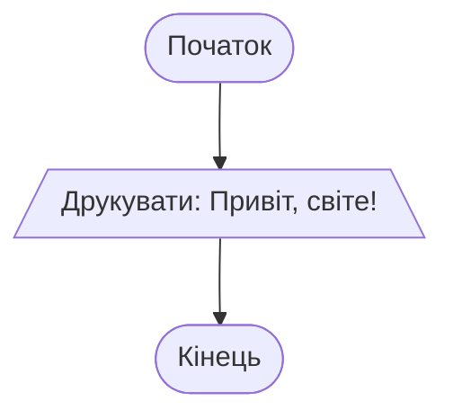
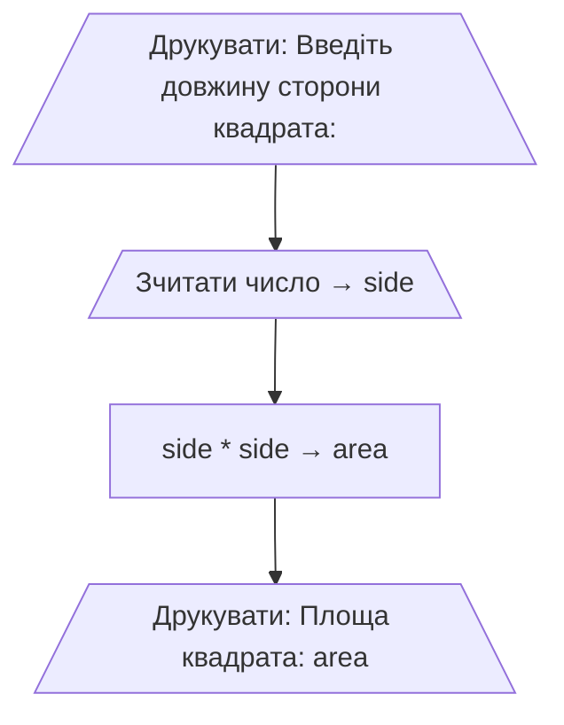

*Для розуміння цієї теми потрібно знати про:*
* *[Вивід - функція print](Вивід%20-%20функція%20print.md)*
* *[Змінні - присвоєння значень](Змінні%20-%20присвоєння%20значень.md)*
* *[Ввід - функція input](Ввід%20-%20функція%20input.md)*

# Блок-схеми - послідовне виконання, введення та виведення

Блок-схеми (flowcharts) — це графічний спосіб представлення алгоритму програми. Вони допомагають візуалізувати послідовність дій, які виконує програма, та зрозуміти логіку її роботи. Блок-схеми використовують різні фігури для різних типів операцій.

## Найпростіший приклад — "Привіт, світе!"

Розглянемо найпростішу програму, яка друкує повідомлення:

```python
print("Привіт, світе!")
```

Блок-схема цієї програми виглядає так:



## Основні елементи блок-схеми

* **Початок** (овал) — позначає початок виконання програми. У простіших блок-схемах цей блок можна опустити, якщо з контексту зрозуміло, що виконання починається з першої операції.
* **Введення/Виведення** (паралелограм) — позначає операцію вводу або виводу даних (зчитування з клавіатури або друкування на екран). У паралелограмі вказується, які саме дані зчитуються чи друкуються.
* **Обробка** (прямокутник) — використовується для позначення обчислень та інших операцій, які виконує програма.
* **Кінець** (овал) — позначає завершення виконання програми. Як і блок "Початок", його можна опустити в простих схемах.

Стрілки показують послідовність виконання операцій: спочатку виконується операція, на яку вказує стрілка, потім наступна, і так далі.

## Приклад програми, що виконує обчислення

Розглянемо приклад програми, що знаходить площу квадрата зі стороною, яку вводить користувач.

```python
print("Введіть довжину сторони квадрата:")
side = int(input())
area = side * side
print("Площа квадрата:", area)
```

Результат:
```
Введіть довжину сторони квадрата:
4
Площа квадрата: 16
```

Блок-схема цієї програми:



Така послідовність дій є прикладом послідовного виконання: друкуємо підказку, зчитуємо число, обчислюємо площу й друкуємо результат.
