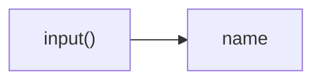
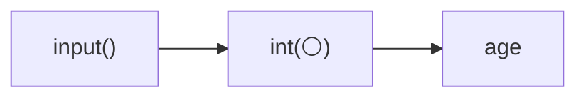
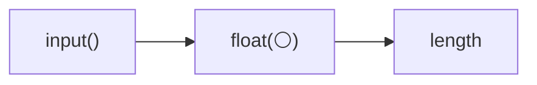

*Для розуміння цієї теми потрібно знати про:*
* *[Вивід - функція print](Вивід%20-%20функція%20print.md)*
* *[Змінні - присвоєння значень](Змінні%20-%20присвоєння%20значень.md)*
* *[Типи значень - рядки, цілі та дійсні числа](Типи%20значень%20-%20рядки,%20цілі%20та%20дійсні%20числа.md)*
* *[Перетворення типів](Перетворення%20типів.md)*

# Ввід - функція input

Функція `input()` дозволяє запитувати дані у користувача під час роботи програми. Це дозволяє програмі обробляти будь-які дані, а не лише ті, які заздалегідь записані в коді програми.

Після виклику `input()` програма зупиняється і чекає, доки користувач не введе текст і натисне Enter. Після цього функція `input()` повертає рядок тексту, який ввів користувач.

Кожен виклик `input()` повертає рядок тексту (значення типу `str`), тому ми можемо або працювати з поверненим рядком напряму, або перетворити його на число (значення типу `int` або `float`), якщо плануємо виконувати обчислення.

У більшості випадків перед викликом `input()` також слід надрукувати підказку для користувача, щоб пояснити користувачеві, що саме потрібно ввести.


## Зчитування рядків (`str`)

Щоб прочитати довільний текст, достатньо викликати `input()` і зберегти результат. 

```python
print("Введіть ім'я:")
name = input()
print("Привіт,", name)
```

Результат:
```
Введіть ім'я:
Оля
Привіт, Оля
```

Рядок `name = input()` з прикладу вище можна пояснити так:



1. Функція `input()` почекає, доки користувач введе текст та натисне Enter. Після цього вона поверне цей текст у вигляді рядка (значення типу `str`).
2. Рядок тексту, який повернула функція `input()`, буде збережено у змінній з ім'ям `name`.

## Зчитування цілих чисел (`int`)

Іноді потрібно виконати математичні операції з введеним значенням (наприклад, додати до введеного віку ще один рік). У такому випадку рядок з текстом, що містить цифри (значення типу `str`), повернений з `input()`, треба перетворити на ціле число (значення типу `int`) за допомогою функції `int()`.

```python
print("Введіть вік:")
age = int(input())
next_age = age + 1
print("Наступного року вам буде:", next_age)
```

Результат:
```
Введіть вік:
14
Наступного року вам буде: 15
```

Рядок `age = int(input())` з прикладу вище можна пояснити так:



1. Функція `input()` почекає, доки користувач введе текст та натисне Enter. Після цього вона поверне цей текст у вигляді рядка (значення типу `str`, позначене символом ⚪).
2. Функція `int()` отримає рядок з текстом як аргумент та поверне ціле число (значення типу `int`), що було отримано з цифр цього рядка тексту.
3. Ціле число, яке повернула функція `int()`, буде збережено у змінній з ім'ям `age`.

## Зчитування дійсних чисел (`float`)

Коли потрібно працювати зі значеннями, де важлива частина після крапки (наприклад, вимірюваннями), рядок, повернений з `input()`, потрібно перетворити на дійсне число (значення типу `float`). 

```python
print("Введіть довжину відрізка в сантиметрах:")
length = float(input())
print("Половина довжини:", length / 2)
```

Результат:
```
Введіть довжину відрізка в сантиметрах:
7.5
Половина довжини: 3.75
```

Рядок `length = float(input())` з прикладу вище можна пояснити так:



1. Функція `input()` почекає, доки користувач введе текст та натисне Enter. Після цього вона поверне цей текст у вигляді рядка (значення типу `str`, позначене символом ⚪).
2. Функція `float()` отримає рядок з текстом як аргумент та поверне дійсне число (значення типу `float`), що було отримано з цифр цього рядка тексту.
3. Дійсне число, яке повернула функція `float()`, буде збережено у змінній з ім'ям `length`.

## Як використовувати `input()` для різних типів даних

У цій таблиці показано, як використовувати функцію `input()` разом з відповідними типами даних, щоб зберегти введене значення у змінну.

| Тип даних, що зчитується              | Приклад коду                            |
|---------------------------------------|-----------------------------------------|
| Зчитування рядка (`str`)              | `name = input()`                        |
| Зчитування цілого числа (`int`)       | `age = int(input())`                    |
| Зчитування дійсного числа (`float`)   | `length = float(input())`               |

<!-- TODO use term "введення"/"виведення" -->
