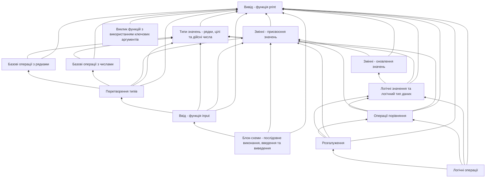

# Залежності

Діаграма залежностей між статтями посібника. 

```mermaid
graph BT
    A["Вивід - функція print"] 
    B["Типи значень - рядки, цілі та дійсні числа"]
    C["Змінні - присвоєння значень"]
    D["Змінні - оновлення значень"]
    E["Базові операції з числами"]
    F["Базові операції з рядками"]
    G["Перетворення типів"]
    H["Ввід - функція input"]
    I["Блок-схеми - послідовне виконання, введення та виведення"]
    J["Логічні значення та логічний тип даних"]
    K["Операції порівняння"]
    L["Логічні операції"]
    M["Розгалуження"]
    N["Виклик функцій з використанням ключових аргументів"]
    
    B --> A
    C --> A
    D --> A
    D --> C
    E --> A
    E --> B
    F --> A
    F --> B
    G --> A
    G --> B
    G --> C
    G --> E
    G --> F
    H --> A
    H --> C
    H --> B
    H --> G
    I --> A
    I --> C
    I --> H
    J --> A
    J --> B
    J --> D
    K --> A
    K --> B
    K --> C
    K --> J
    L --> A
    L --> J
    L --> K
    L --> M
    M --> A
    M --> C
    M --> J
    M --> K
    N --> A
```

