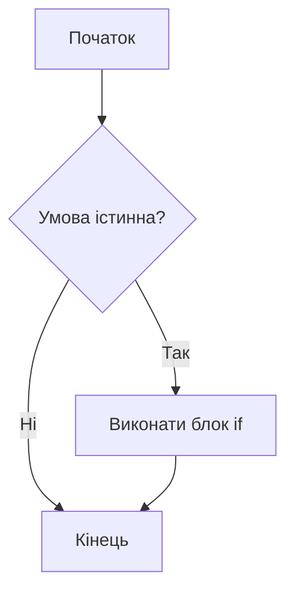
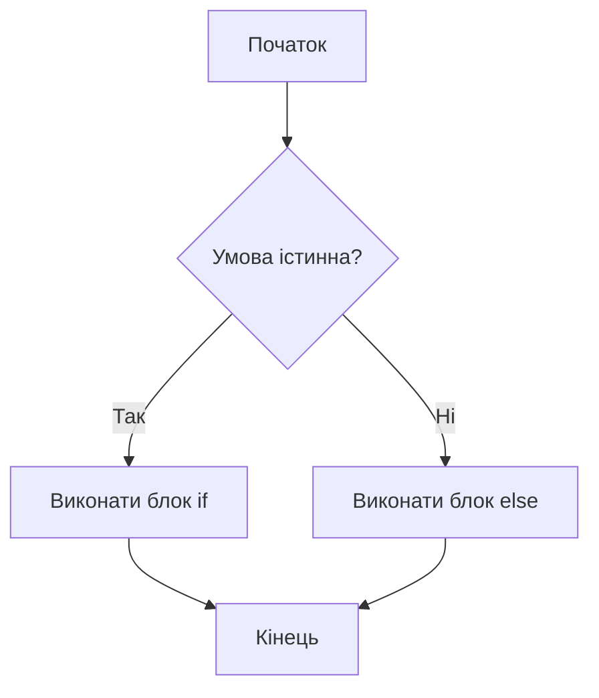
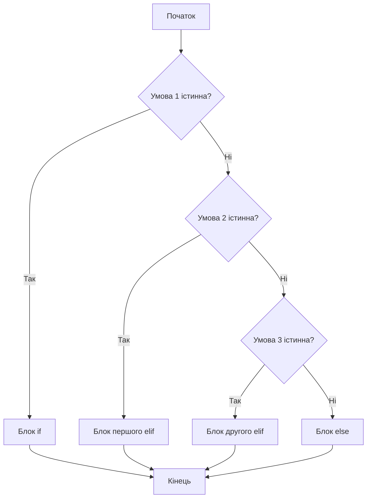

*Для розуміння цієї теми потрібно знати про:*
* *[Вивід - функція print](Вивід%20-%20функція%20print.md)*
* *[Змінні - присвоєння значень](Змінні%20-%20присвоєння%20значень.md)*
* *[Логічні значення та логічний тип даних](Логічні%20значення%20та%20логічний%20тип%20даних.md)*
* *[Операції порівняння](Операції%20порівняння.md)*

# Розгалуження

У програмах часто потрібно виконувати різні дії залежно від умови. Для цього в Python є **розгалуження** — конструкції `if`, `if - else` та `if - elif - else`. Вони дозволяють перевіряти умови й обирати один з кількох шляхів виконання коду.

---

## Просте розгалуження `if`

Конструкція `if` дозволяє **виконати блок коду тільки тоді, коли умова істинна**. Якщо умова хибна, цей блок просто пропускається.

```python
temperature = 25

if temperature > 20:
    print("На вулиці тепло")
```

**Результат друкування:**

```text
На вулиці тепло
```

Якщо змінити `temperature` на значення, що не більше 20, повідомлення не буде надруковано, бо тіло `if` пропускається.

**Блок-схема для `if`:**



---

## Розгалуження `if - else`

Конструкція `if - else` використовується, коли потрібно **обрати між двома взаємовиключними варіантами**: один код виконується, якщо умова істинна, інший — якщо хибна.

```python
age = 15

if age >= 18:
    print("Дорослий квиток")
else:
    print("Дитячий квиток")
```

**Можливі результати друкування:**

- якщо `age = 20`:

```text
Дорослий квиток
```

- якщо `age = 15`:

```text
Дитячий квиток
```

**Блок-схема для `if - else`:**



---

## Розгалуження `if - elif - else`

Якщо можливих варіантів більше ніж два, зручно використовувати **ланцюжок умов** `if - elif - else`.  
`elif` (скорочено від *else if*) додає нову умову, яка перевіряється, якщо попередні умови виявилися хибними.

```python
score = 78  # тестовий бал від 0 до 100

if score >= 90:
    print("Оцінка: відмінно")
elif score >= 70:
    print("Оцінка: добре")
elif score >= 50:
    print("Оцінка: задовільно")
else:
    print("Оцінка: потрібно підтягнутися")
```

**Приклад результатів друкування:**

- `score = 95` → `Оцінка: відмінно`
- `score = 78` → `Оцінка: добре`
- `score = 55` → `Оцінка: задовільно`
- `score = 30` → `Оцінка: потрібно підтягнутися`

У цьому ланцюжку **виконується тільки перший підходящий блок**. Якщо якась умова стала істинною, всі наступні `elif` та `else` вже не перевіряються.

**Блок-схема для `if - elif - else`:**



---
