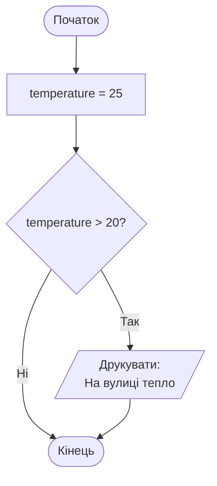
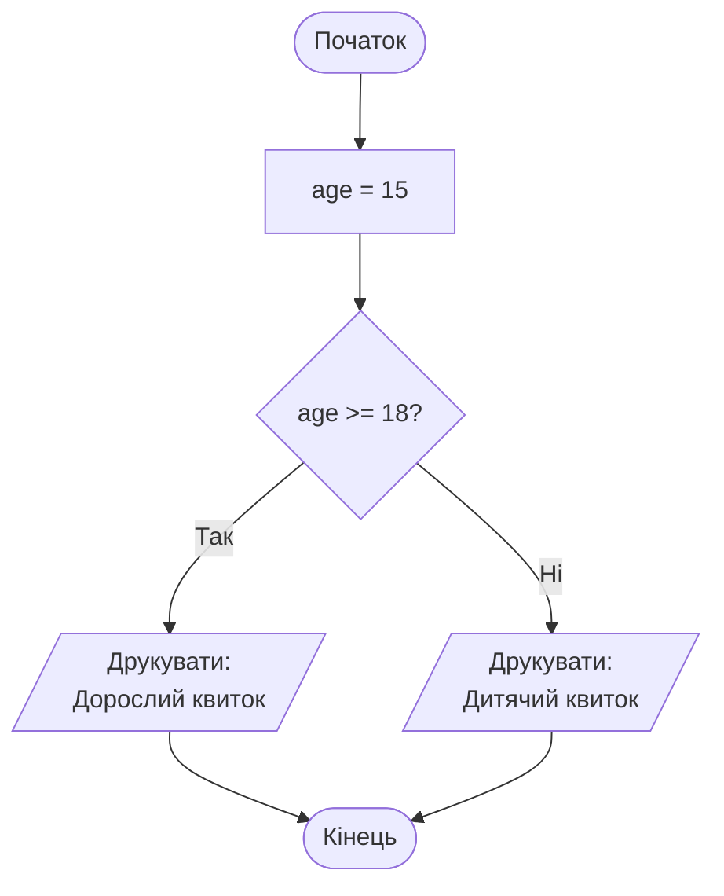
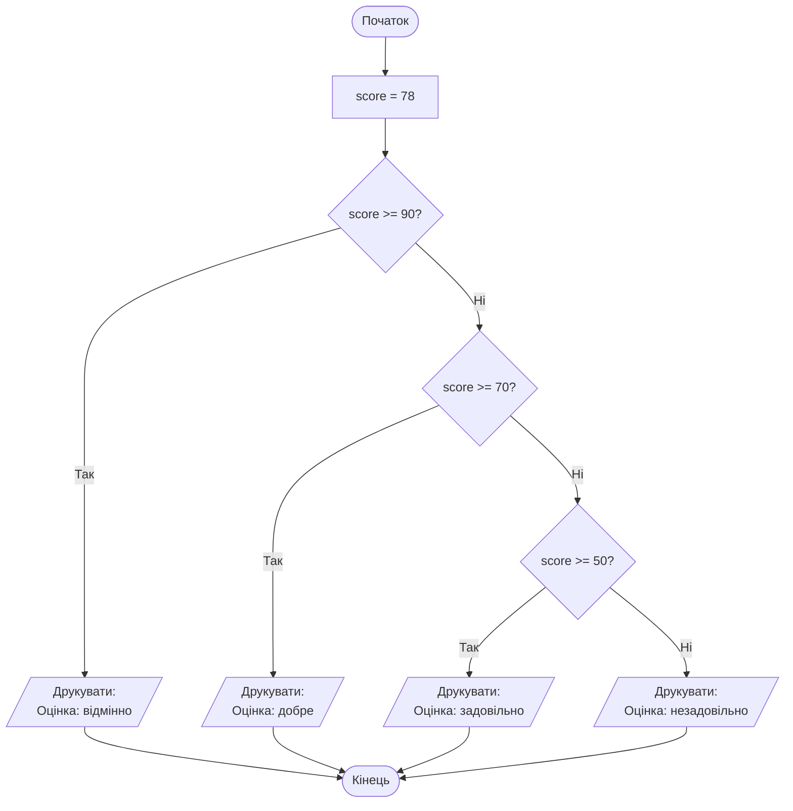

*Для розуміння цієї теми потрібно знати про:*
* *[Вивід - функція print](Вивід%20-%20функція%20print.md)*
* *[Змінні - присвоєння значень](Змінні%20-%20присвоєння%20значень.md)*
* *[Логічні значення та логічний тип даних](Логічні%20значення%20та%20логічний%20тип%20даних.md)*
* *[Операції порівняння](Операції%20порівняння.md)*

# Розгалуження

У програмах часто потрібно виконувати різні дії залежно від певної умови. Для цього в Python використовуються розгалуження — конструкції `if`, `if - else` та `if - elif - else`. Вони дозволяють перевіряти умови (наприклад, результати порівнянь) і обирати один з кількох шляхів виконання коду (гілок алгоритму).

---

## Просте розгалуження `if`

Конструкція `if` дозволяє виконати блок коду (гілку алгоритму) тільки тоді, коли умова істинна. Якщо умова хибна, цей блок просто пропускається.

```python
temperature = 25

if temperature > 20:
    print("На вулиці тепло")
```

Результат:

```text
На вулиці тепло
```

Структура конструкції `if` складається з двох частин:

* Умова — це вираз після ключового слова `if`, який обчислюється до логічного значення (`True` або `False`). У прикладі вище умова — це `temperature > 20`. Після умови обов'язково ставиться двокрапка `:`.

* Блок коду (гілка алгоритму) — це один або кілька рядків коду, які виконуються, якщо умова істинна. Блок коду пишеться з відступом (зазвичай 4 пробіли) після двокрапки. У прикладі блок складається з одного рядка `print("На вулиці тепло")`.

Важливо: всі рядки блоку повинні мати однаковий відступ. Коли відступ закінчується, закінчується і блок коду.

Блок-схема цієї програми:



Якщо змінити `temperature` на значення, що не більше 20, повідомлення не буде надруковано, тому що блок `if` пропускається.

## Розгалуження `if - else`

Конструкція `if - else` використовується, коли потрібно обрати між двома взаємовиключними варіантами: один блок коду виконується, якщо умова істинна, інший — якщо хибна.

```python
age = 15

if age >= 18:
    print("Дорослий квиток")
else:
    print("Дитячий квиток")
```

Результат:

```text
Дитячий квиток
```

Блок-схема цієї програми:



У цьому прикладі спочатку перевіряється умова `age >= 18`. Якщо вона істинна (вік 18 або більше), виконується блок `if` і друкується "Дорослий квиток". Якщо умова хибна (вік менше 18), виконується блок `else` і друкується "Дитячий квиток".

Якщо змінити `age` на 20, умова `age >= 18` стане істинною (20 більше 18), тому виконається блок `if` і буде надруковано "Дорослий квиток". Блок `else` у цьому випадку пропуститься.


## Розгалуження `if - elif - else`

Для вибору між трьома або більше варіантами використовується ланцюжок умов `if - elif - else`. Ключове слово `elif` (скорочено від *else if*) додає нову умову, яка перевіряється лише якщо всі попередні умови виявилися хибними. Виконується тільки перший блок, умова якого стала істинною. Після цього всі наступні `elif` та `else` вже не перевіряються.


```python
score = 78  # тестовий бал від 0 до 100

if score >= 90:
    print("Оцінка: відмінно")
elif score >= 70:
    print("Оцінка: добре")
elif score >= 50:
    print("Оцінка: задовільно")
else:
    print("Оцінка: незадовільно")
```

Блок-схема цієї програми:



Результат:

```text
Оцінка: добре
```

